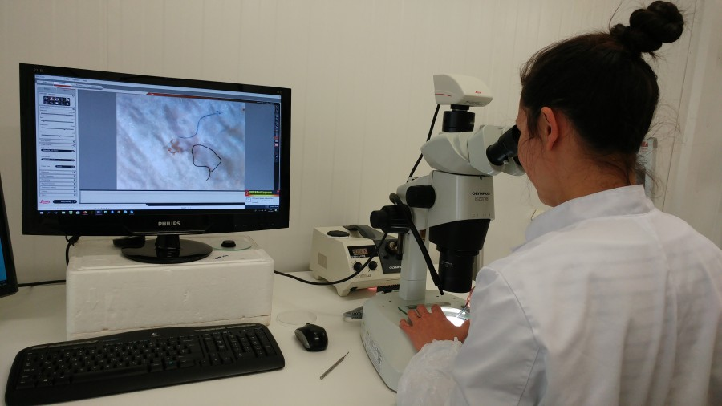
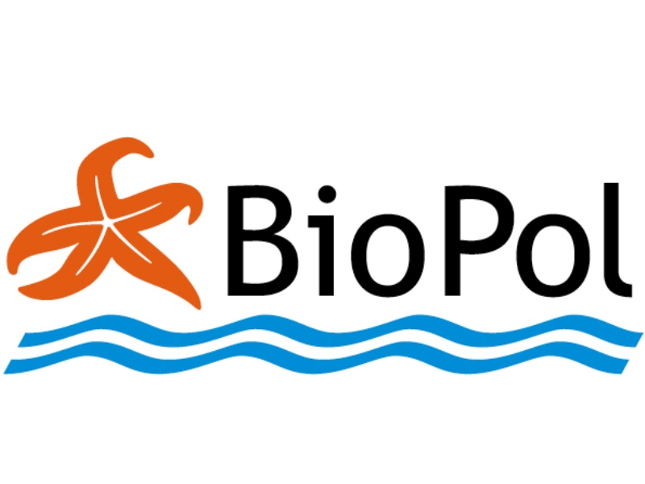
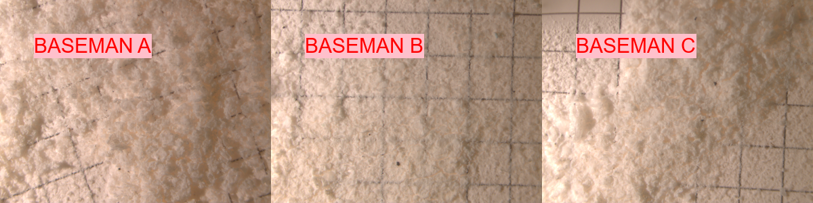
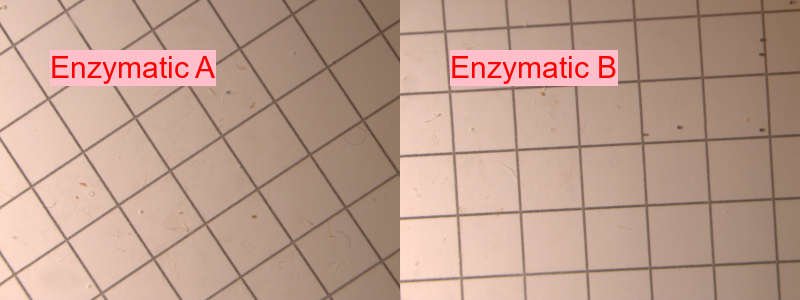
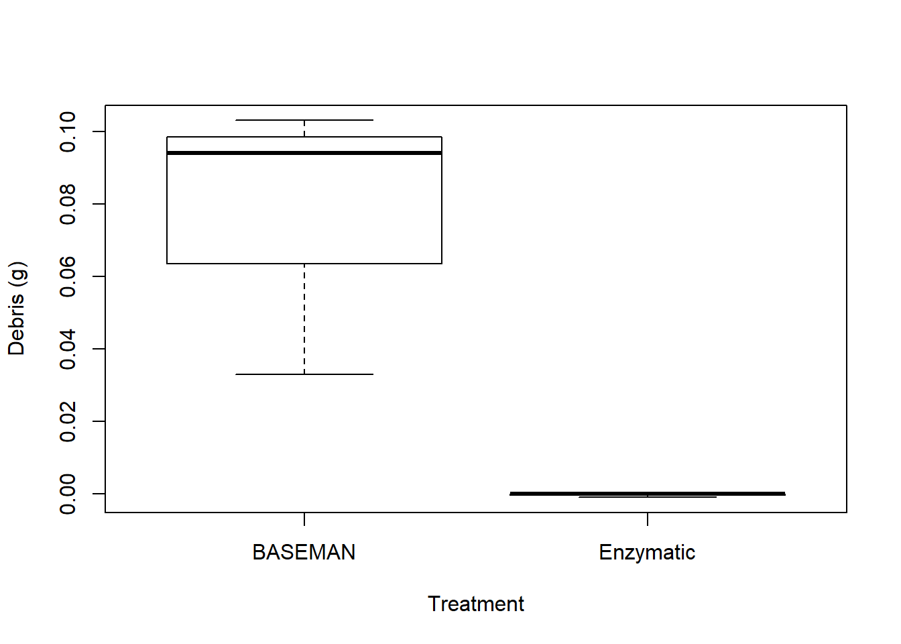

class: split-33

.column.bg-main2[
.content.vmiddle[
.center[
# Main Sources of Microplastics
<br>
<br>
.font-mono[Estimates in tonnes]

]]]

.column[
.content[
.center[
  
```{r echo=FALSE, message=FALSE, warning=FALSE, cache=FALSE, out.height="100%"}
    #losun <- (l+h)/2 #Meðaltal lægra og hærra mats á losun.
    value <- c(371, 41, 26, 33.2, 60, 3, 0.2, 8.2, 0.34, 1, 0.002) #Uppspretta lægra mat
    losun <- c(164, 5.7,  0, 15.2, 3.2, 0.3, 0, 8.2, 0.34, 0, 0.002) #losun lægra mat
    #value <- c(379,586,38,233,21,48,3,11,8,32,0.3,3)
    heiti <- c('Car tires ',
               'Road paint ',
               'Airplane tires ',
               'House paint ',
               'Ship paint ',
               'Artificial turf ',
               'Playgrounds ',
               'Laundry ',
               'Cosmetics ',
               'Hail shots ',
               'Landfill leachates ')
    land <- value-losun
    df <- data.frame(heiti,land,losun)
    df <- df[order(df$heiti),]
    
    library(networkD3)
    nodes <- c(levels(df$heiti), 'Land','Sea')
    nodes <- as.data.frame(nodes)
    names(nodes) <- "name"
    
    a <- list()
    for (i in 1:nrow(df)) {
      a[i] <- list(rbind(matrix(c(df[i,c(2,3)]))))
    }
    b <- do.call(c,a)
    value <- unlist(b)
    
    links <- 
      data.frame(
        source=c(0,0,1,1,2,2,3,3,4,4,5,5,6,6,7,7,8,8,9,9,10,10),
        target=c(rep(c(11,12),11)),
        value=value)
    
    
    Sank <- list(nodes, links)
    names(Sank) <- c('nodes', 'links')
    sn <- sankeyNetwork(
      Links = Sank$links,
      Nodes = Sank$nodes,
      Source = "source",
      Target = "target",
      Value = "value",
      NodeID = "name",
      units = "tonn",
      colourScale = JS("d3.scaleOrdinal(d3.schemeCategory20);"),
      fontSize = 20,
      nodeWidth = 30, height = "681px", fontFamily = "Monospace"
    )
    rammi <- widgetframe::frameWidget(sn)
    rammi
    
```
    
]]]


---

class: split-two with-thick-border border-cyan
.column.bg-white[
  .split-two[
.row.bg-white[.content.vmiddle[.center[
  .nopadding[
.img-fill[]
]
  ]]]
  .row.bg-white[.content.vmiddle[.center[
  .nopadding[
.img-fill[]
]
  ]]]
]]

.column.bg-main1[.content.center.vmiddle[
# Microplastic Sampling
# .deep-orange[Skagaströnd] 
## .white[<span class=" faa-pulse animated-hover " style=" display: -moz-inline-stack; display: inline-block; transform: rotate(0deg);"> [skʰaːɣastrœn̥d] </span>]
<br><br>

```{r logo, echo=FALSE, message=FALSE, warning=FALSE, cache=FALSE,out.width = '50%'}
mynd <- 
mynd
```
]]

???
[BioPol report](https://harkanatta.github.io/MPprotocol/)

Environmental sampling with a 125 μm zooplankton net

Notice the rope :)


---

layout: false
class: split-two white
.column.bg-main1[.content[
## .black[Our little] .orange[comparison study] .black[between the ] .orange[ BASEMAN protocol] .black[and an] .orange[ ENZYMATIC purification] .black[ of environmental samples]
<br>
<br>
Comparison of Enzymatic purification and GESAMP protocol
Replication of the methods from the article: [Enzymatic Purification of Microplastics in Environmental Samples](https://sci-hub.se/10.1021/acs.est.7b03055).

<br>
  .img-fill[]
<br>
  .img-fill[]

]]

.column.bg-main2[.content[
<br>
<br>
<br>
<br>
  .img-fill[]
]]

???
BASEMAN (Chemical degradation)

10 % potassium hydroxide solution (KOH)

10 % hydrogen peroxide (H2O2)

Löder 2017 (Enzymatic Purification)

chitinase, proteinase, and cellulase

We need to increase our sampling volume. For that purpose we added a Manta net to our fleet (333 μm).


  